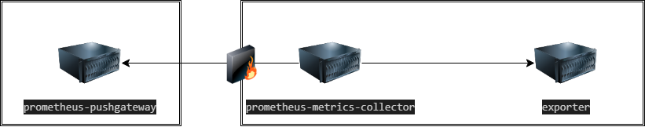

# Prometheus Metrics Collector

The prometheus-metrics-collector application acts as a bridge between the exporter and prometheus-pushgateway. It operates based on the following principles:

- Works in a pull model relative to the exporter.
- Works in a push model relative to the prometheus-pushgateway.

## Launch Parameters

- EXPORTER_URL: URL to fetch metrics from (must be in prometheus format).
- PUSHGATEWAY_URL: URL to send metrics to.
- JOB_NAME: Job name.
- INTERVAL: Interval for scraping metrics in seconds.
- LOG_LEVEL: Logging level.

Example of launch parameters:

```shell
      - EXPORTER_URL=http://localhost:9100/metrics
      - PUSHGATEWAY_URL=http://prometheus:9191/metrics/job/exporter
      - JOB_NAME=kafka
      - INTERVAL=30
      - LOG_LEVEL=DEBUG
```

## How to Use

```shell
docker-compose up -d
```
scheme of work

